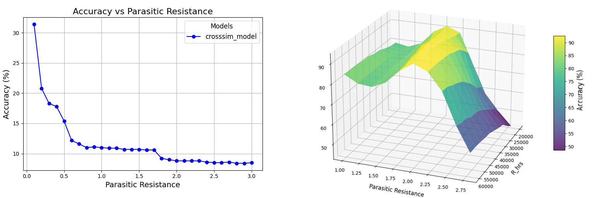

# Crossbar Parasitics Simulator

A comprehensive tool for modeling and analyzing parasitic effects in crossbar arrays. This repository provides two main functionalities:
1. **Model Comparison** – Benchmarks a variety of parasitic resistance models from the literature.  
2. **Hardware-Aware Training** – Enables training and evaluation of neural networks using the models.

## Table of Contents
1. [Features](#features)  
   1.1 [Model Comparison](#model-comparison)  
   1.2 [Hardware-Aware Training](#hardware-aware-training)  
2. [Installation](#installation)  
3. [Usage](#usage)  
   3.1 [Crossbar Simulation](#crossbar-simulation)  
   3.2 [Parasitic-Aware Neural Network](#parasitic-aware-neural-network)  
4. [Suggestions for Improvement](#suggestions-for-improvement)  
5. [Citation](#citation)  

---

## Features

### Model Comparison
- **Supported Models**  
  \- Ideal, [Jeong](https://ieeexplore.ieee.org/document/8219726), [DMR](https://ieeexplore.ieee.org/document/9184938/), [αβ-matrix](https://ieeexplore.ieee.org/document/9691996/), [CrossSim](https://cross-sim.sandia.gov/), [Memtorch](https://ieeexplore.ieee.org/document/9180810/), ngSpice, LTSpice.   
  \- Easily switch the reference model (CrossSim by default). 

- **Parametric Analysis**  
  \- Adjustable array sizes.  
  \- Configurable parasitic resistance values, memory window ratios (HRS/LRS), and device non-linearities.  
  \- Tunable sparsity levels (% of HRS devices).  
  \- Device variability for realistic crossbar simulation.  

- **Performance Metrics**  
  \- Execution time benchmarking.  
  \- Current/voltage error measurements (relative error).  
  \- Robustness evaluations under varying crossbar parameters.  

### Hardware-Aware Training
- **Memristive Neural Network Setup**  
  \- Two-layer fully connected architecture for MNIST classification, with configurable hidden layer.  
  \- Flexible tile partitioning, linear mapping of weights to conductances and quantization.  

- **Training and Testing**  
  \- Parasitic resistance incorporation into training, using parasitic models with automatic differentiation.  
  \- Weights, biases, and confusion matrix visualizations after training. 2D and 3D accuracy plots for evaluation.

---

## Installation

1. **Clone the Repository**  
   ```bash
   git clone https://github.com/alambertini01/Crossbar_Models_Comparison
   cd Crossbar_Models_Comparison
   ```

2. **Create and Activate a Virtual Environment (Optional)**  
   *Windows*:
   ```bash
   python -m venv .venv
   .venv\Scripts\activate
   ```  
   *macOS/Linux*:
   ```bash
   python -m venv .venv
   source .venv/bin/activate
   ```

3. **Install the Package**  
   ```bash
   pip install -e .
   ```

4. **(Optional) Installing NgSpice**  
   If you plan to use the NgSpice-based model:
   ```bash
   pyspice-post-installation --install-ngspice-dll
   pyspice-post-installation --check-install
   ```

---

## Usage

### 1. Crossbar Simulation

#### 1.1 Model Performance Comparison
```bash
python Crossbar_Simulator.py
```
- Ideal for in-depth current and voltage analysis on custom-sized arrays.  
- Offers detailed parameter tuning (resistance ratios, device variability, etc.).


#### 1.2 Robustness Analysis
```bash
python Crossbar_Simulator_Robustness.py
```
- Runs comprehensive simulation sweeps across multiple parameters.  
- Generates robustness metrics (radar plots, 3D MSE plots).


### 2. Parasitic-Aware Neural Network

#### 2.1 Training
```bash
python NN_Training.py
```
- Trains a two-layer MNIST classifier with PyTorch-based crossbar models (located in `CrossbarModels/Crossbar_Models_pytorch.py`).  
- Command-line prompts allow setting parasitic resistance, HRS, tile size, etc.  
- Additional parameters (LRS, quantization bits, training checkpoints) can be modified within the script.  
- Trained models are saved in `TrainedModels/ModelName`.
- For GPU acceleration make sure to install pythorch based on your specific cuda version


#### 2.2 Testing
```bash
python NN_testing.py
```
- Loads a trained model and evaluates its accuracy.  
- Different models can be used as reference, but it's recommended to use the CrossSim model for reliable validation.  
- Further analysis on accuracy can be performed by sweeping parameters like R_HRS and bits.



---

## Citation
```bibtex
@software{crossbar_simulator,
  author = {Lambertini, Alessandro},
  title = {Crossbar Parasitics Simulator},
  year = {2024},
  publisher = {GitHub},
  url = {https://github.com/alambertini01/Crossbar_Models_Comparison}
}
```
